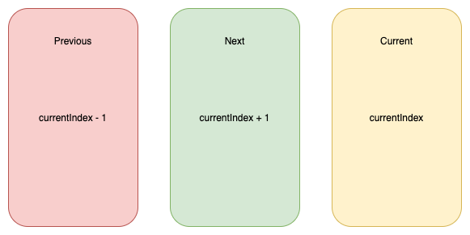
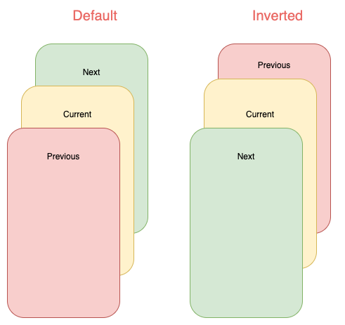

# flicked_cards

<p align="center">
<a href="https://github.com/DanielCardonaRojas/flicked_cards/actions/workflows/test.yaml">

</a>
<a href="https://codecov.io/gh/DanielCardonaRojas/flicked_cards">
  
</a>


<a href="https://opensource.org/licenses/MIT">

</a>

</p>

A gesture driven card swipping widget supporting custom animations.

## Features

- Awesome default behaviours provided
- Progress through cards swipping both direction or in a single direction
- Extensible through custom provided animations
- Support piling or popping (depending on animation spec)


## Examples

Here are some of the animation provided out of the box, take a look at the example to see all.

<div align="center">
  
  
  
  
</div>

Cards used in these examples where taken from [Brocodev](https://github.com/brocodev/flutter_projects) 

# Custom animations

`flicked_cards` provides an easy way to create custom animations but it is required to have a basic understanding
of how cards can be layed out and how to position them depending on the drag progress and some of the properties in `AnimationConfig`.


Animations will be provided a `progress` value in the range (-1, 1) you should try to make you animation symmetric around 0
when posible. Like this:


You will have to reason about relative card indices:



## Interface for animations

All animations will need to implement `CardAnimation` which basically
defines: 

- animation of a particular card depending on swipe progress `required` 
- opacity of a particular card depending on swipe progress `optional` 
- where to apply transformations on cards (Fractional Offset) 

```dart
typedef SwipeAnimation = Matrix4 Function(double progress);
typedef OpacityAnimation = double Function(double progress);

abstract class CardAnimation {
  AnimationConfig get config;
  LayoutConfig get layoutConfig;

  SwipeAnimation animationForCard({required int relativeIndex});

  OpacityAnimation opacityForCard({required int relativeIndex}) {
    return (_) => 1;
  }

  FractionalOffset fractionalOffsetForCard({required int relativeIndex});
}
```

Additionally to make this process a bit easier, 2 extra abstract classes that implement 
`CardAnimation` which are:

- `SymmetricCardAnimation`
- `AsymmetricCardAnimation`

Carousel animation is an example of a `SymmetricCardAnimation` take a look [here](https://github.com/DanielCardonaRojas/flicked_cards/blob/main/lib/src/animations/carousel_animation.dart)

## Available layouts

Internally cards are placed in `Stack` widget so an animation can choose to work with a single or both of the following 
layouts:



Note that depending on the index some of cards will not be displayed:


## TODO

- Add sensitivity parameter for wider screens.
- Fix Deck Animation not constant card separation make last and before aligned
